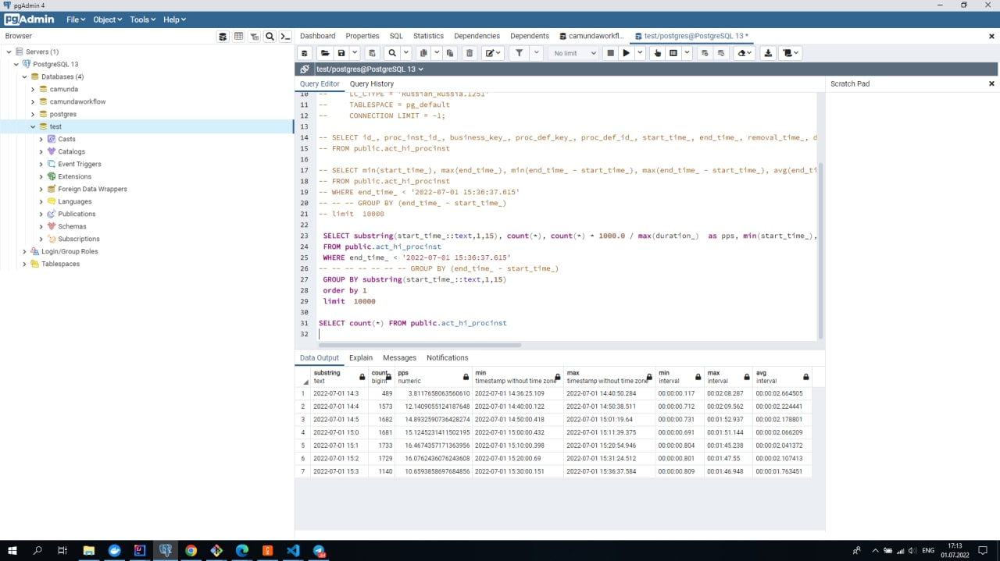
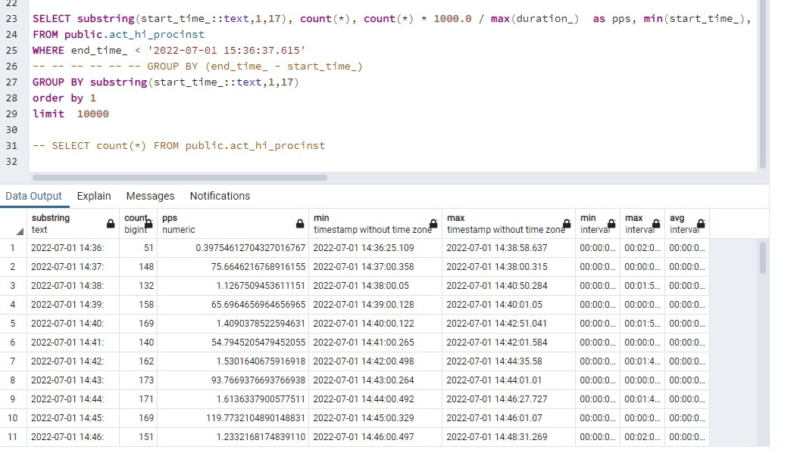
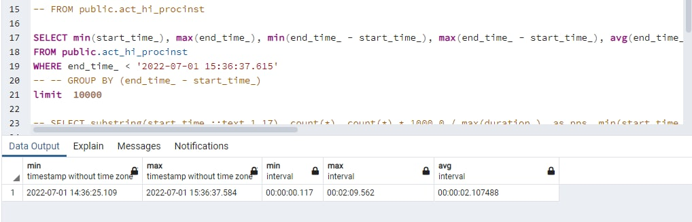

# Changing-balance-of-wallet

Замер производительности  (delegates) для переводов: 

				SELECT id_, proc_inst_id_, business_key_, proc_def_key_, proc_def_id_, start_time_, end_time_, 
				removal_time_, duration_,  start_user_id_, start_act_id_, end_act_id_, super_process_instance_id_, 
				root_proc_inst_id_, super_case_instance_id_, case_inst_id_, delete_reason_, tenant_id_, state_
				FROM public.act_hi_procinst

				SELECT min(start_time_), max(end_time_), min(end_time_ - start_time_), max(end_time_ - start_time_), avg(end_time_ - start_time_)
				FROM public.act_hi_procinst 
				WHERE end_time_ < '2022-06-19 23:11:16.441'
				-- GROUP BY (end_time_ - start_time_) 
				limit  100

				SELECT substring(start_time_::text,1,17), count(*), count(*) * 1000.0 / max(duration_)  as pps, min(start_time_), max(end_time_), min(end_time_ - start_time_), max(end_time_ - start_time_), avg(end_time_ - start_time_)
				FROM public.act_hi_procinst 
				WHERE end_time_ < '2022-06-23 15:29:56.56'
				-- -- -- -- -- GROUP BY (end_time_ - start_time_) 
				GROUP BY substring(start_time_::text,1,17)
				order by 1
				limit  10000

| min_time  | max_time | min_interval | max_interval | avg_interval |
| ------------- | ------------- | ------------- | ------------- | ------------- |
| 2022-07-01 14:36:25.109  | 2022-07-01 15:36:37.584  | 00:00:00.117 | 00:02:09.562  | 00:00:02.107488  | 
